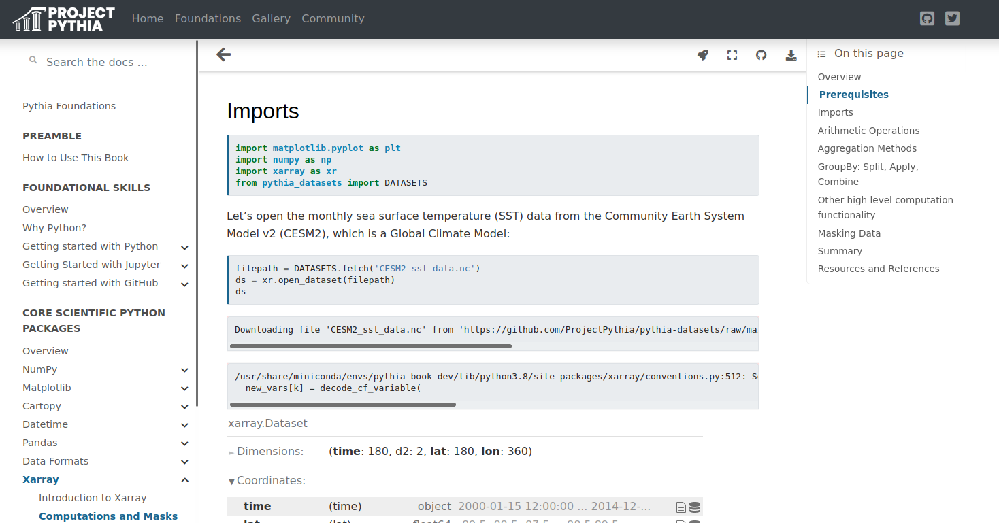
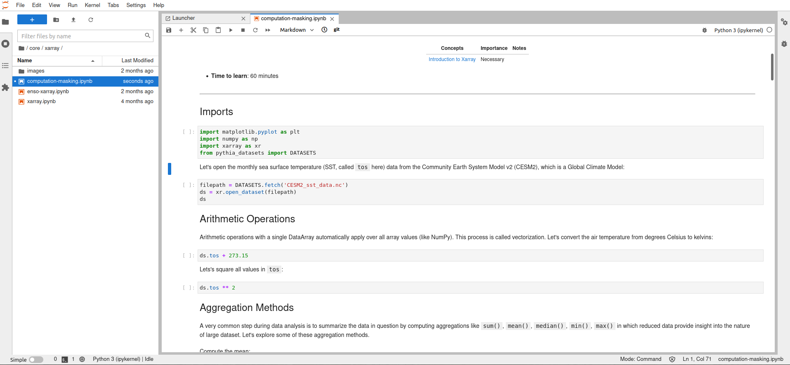
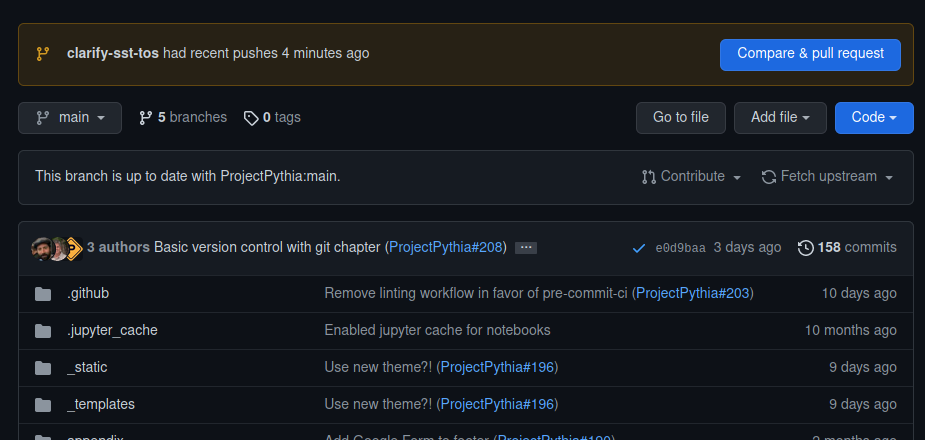
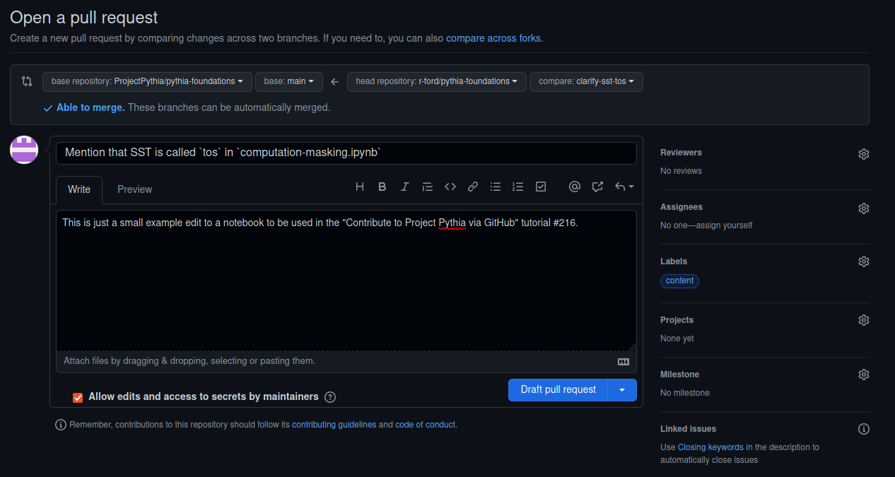
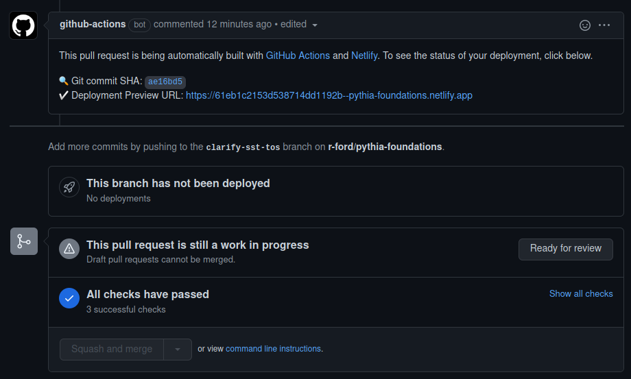

# Contribute to Project Pythia via GitHub

## Overview:

1. Contribute to Project Pythia by creating a PR in the Pythia Foundations repo

## Prerequisites

| Concepts              | Importance | Notes |
| --------------------- | ---------- | ----- |
| Prior GitHub Sections | Necessary  |       |

- **Time to learn**: 30 minutes

---

Now that you have become more familiar with how to use Git and GitHub, you might have an idea or some material that you want to contribute to Project Pythia! The [Project Pythia Contributor's Guide](https://projectpythia.org/contributing.html) describes the steps required to submit a PR to any of Project Pythia's repos, so here we will go through an example of submitting a PR to `pythia-foundations`.

## Suggest a change

One simple way to contribute is to fix a typo or suggest a change to one of the tutorials. For example, in the [Computations and Masks with Xarray tutorial](https://foundations.projectpythia.org/core/xarray/computation-masking.html), let's suggest a clarification that the sea surface temperature is called `tos` in the dataset we are using.



We could open an issue to suggest this change in order to get feedback on the idea before we take the time to edit files, but since this is such a small change, let's just create a PR.

## Make the edits

We will follow the Forking Workflow described in the previous section of this tutorial, assuming `pythia-foundations` has already been forked:

- create a new branch with a descriptive name
- make the changes and commit them locally
- push to the remote repository
- open a PR on GitHub

First, making the new branch,

```bash
git branch clarify-sst-tos
git checkout clarify-sst-tos
```

There are a variety of ways to make changes, depending on the type of file, as well as preference. Here we want to edit a Jupyter Notebook (file extension `.ipynb`), so we can use JupyterLab. We find the file of interest at `/core/xarray/computation-masking.ipynb` and add in some text:



After saving and exiting (and checking for changes with a `git status`), we commit with the following:

```bash
git add core/xarray/computation-masking.ipynb
git commit -m 'Mention that SST is called tos in the model'
```

Then pushing to our remote aliased `origin`:

```bash
git push origin clarify-sst-tos
```

## Create a PR

Now, going to our remote repo on GitHub, forked from `pythia-foundations`, we see that recent changes have been made. By clicking on the "Compare & pull request" button, we can open a PR, proposing that our changes be merged into the main branch of `ProjectPythia/pythia-foundations`.



Project Pythia has an automated reviewer system: when a PR is created, two members of the organization will be randomly chosen to review it. If your PR is not immediately ready to be approved and merged, open it as a draft to delay the review process. Once it is ready, click "Ready for review" to take it out of draft mode.

Let's add the `content` tag and open this one as a draft for now:



For any PR opened in `pythia-foundations`, there will be a few checks that need to pass before merging is allowed. Once the `deploy-book / build` check has completed (which will likely take a few minutes), there will be a Deployment Preview URL commented by the github-actions bot that will take you to a build of the Pythia Foundations book with your edits. There you can ensure your edits show up as expected.



Now we wait for any comments or reviews!

---

## Summary

- You can contribute to Project Pythia by suggesting edits or adding content with a Pull Request
