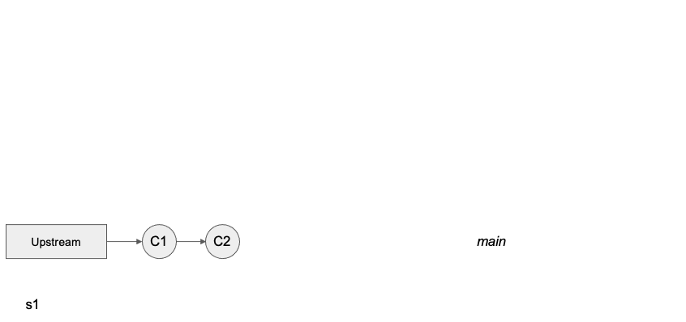
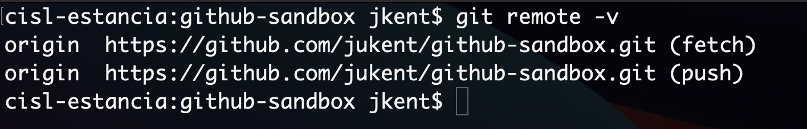
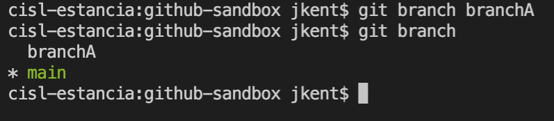
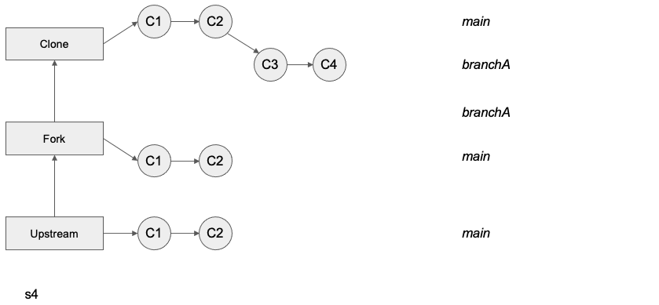
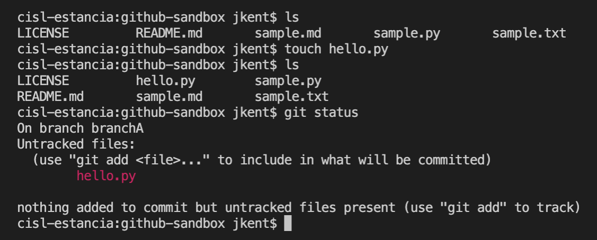
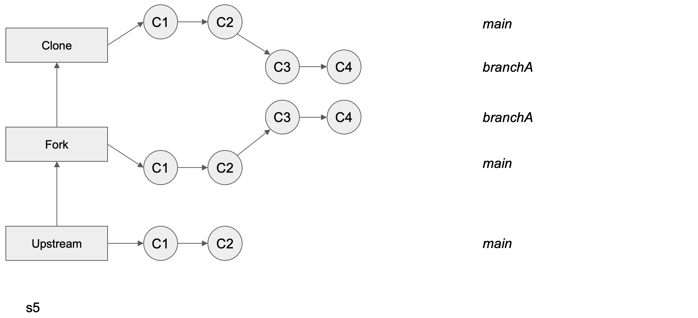
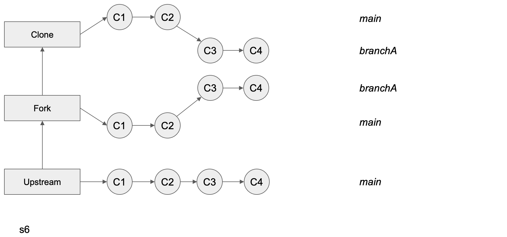
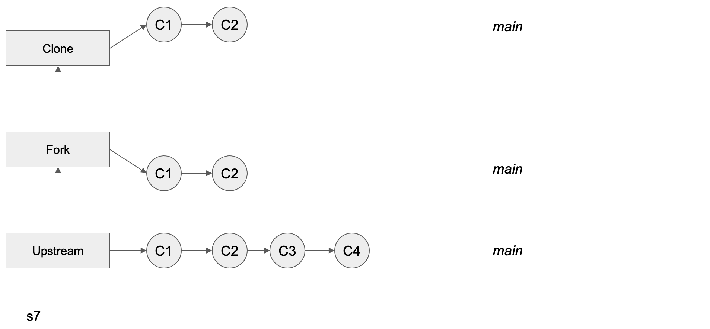
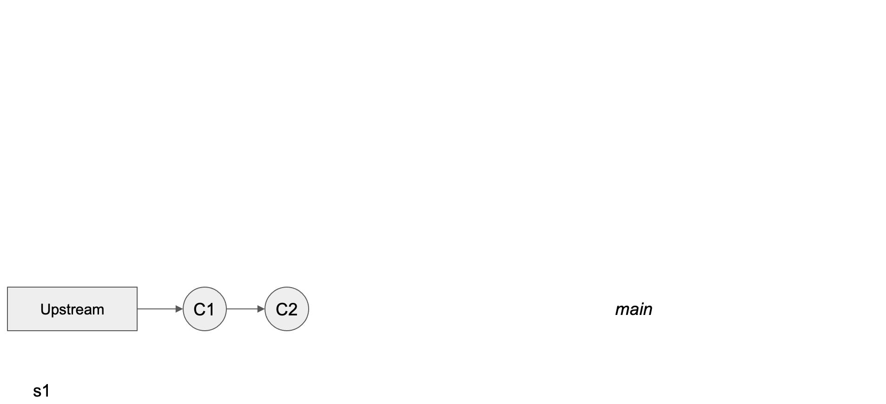

```{image} ../../images/Git-Logo-2Color.png
:alt: Git Logo
:width: 400px
```

# Git Branches

Git "branches" are an important component of many Git and GitHub workflows. If you plan to use GitHub to manage your own resources, or contribute to a GitHub hosted project, it is essential to have a basic understanding of what branches are and how to use them. For example, the best practices for a simple workflow for suggesting changes to a GitHub repository are: create your own fork of the repository, make a branch from your fork where your changes are made, and then suggest these changes move to the upstream repository with a Pull Request. This section of the GitHub chapter assumes you have read the prior GitHub sections, are at least somewhat familiar with git commands and the vocabulary ("cloning," "forking," "merging," "Pull Request" etc), and that you have already created your own fork of the [GitHub Sandbox Repository](https://github.com/ProjectPythia/github-sandbox) hosted by Project Pythia.

## Overview:

1. What are Git Branches
1. Creating a New Branch
1. Switching Branches
1. Setting up a Remote Branch
1. Merging Branches
1. Deleting Branches
1. Updating Your Branches
1. Complete Workflow

## Prerequisites

| Concepts                                                   | Importance  | Notes                        |
| ---------------------------------------------------------- | ----------- | ---------------------------- |
| [What is GitHub?](what-is-github)                          | Necessary   | GitHub user account required |
| [GitHub Repositories](github-repos)                        | Necessary   |                              |
| [Issues and Discussions](github-issues)                    | Recommended |                              |
| [Cloning and Forking a Repository](github-cloning-forking) | Necessary   |                              |
| [Configuring your GitHub Account](github-setup-advanced)   | Recommended |                              |
| [Basic Version Control with _git_](basic-git)              | Necessary   |                              |

- **Time to learn**: 30 minutes

---

## What are Git branches?

Git branches allow for non-linear or differing revision histories of a repository. At a point in time, you can split your repository into multiple development paths (branches) where you can make different commits in each, typically with the ultimate intention of merging these branches and development changes together at a later time.

Branching is one of git's methods for helping with collaborative document editing, much like "change tracking" in Google Docs or Microsoft Word. It enables multiple people to edit copies of the same document content, while reducing or managing edit collisions, and with the ultimate aim of merging everyone's changes together later. It also allows the same person to edit multiple copies of the same document, but with different intentions. Some reasons for wanting to split your repository into multiple paths (i.e. branches) is to experiment with different methods of solving a problem (before deciding which method will ultimately be merged) and to work on different problems within the same codebase (without confusing which code changes are relevant to which problem).

These branches can live on your computer (local) or on GitHub (remote). They are brought together through Git _pushes_, _pulls_, _merges_, and _Pull Requests_. _Pushing_ is how you transfer changes from your local repository to a remote repository. _Pulling_ is how you fetch upstream changes into your branch. _Merging_ is how you piece the forked history back together again (i.e. join two branches). And _Pull Requests_ are how you suggest the changes you've made on your branch to the upstream codebase.

```{admonition} Pull Requests
:class: info
We will cover [Pull Requests]((github-pull-request)) more in-depthly in the next section.
```

One rule of thumb is for each development feature to have its own development branch until that feature is ready to be added to the upstream (remote) codebase. This allows you to compartmentalize your Pull Requests so that smaller working changes can be merged upstream independently of one another. For example, you might have a complete or near-complete feature on its own branch with an open Pull Request awaiting review. While you wait for feedback from the team before merging it, you can still work on a second feature on a second branch without affecting your first feature's Pull Request. **We encourage you to always do your work in a designated branch.**

## Creating a New Branch

```{admonition} Have you forked the repository?
:class: info
Having forked (NOT just cloned) the [GitHub Sandbox Repository](https://github.com/ProjectPythia/github-sandbox) is essential for following the steps in this book chapter. See the chapter on [GitHub Cloning and Forking](github-cloning-forking.md).
```


The above flowchart demonstrates forking a remote repository, labeled "Upstream", creating a local copy, labeled "Clone", creating a new branch, "branchA", and adding two commits, C3 and C4, to "branchA" of the local clone of the forked repository. Different commits can be added to different branches in any order without depending on or knowing about each other.

From your terminal, navigate to your local clone of your `Github-Sandbox` Repository fork:

```bash
cd github-sandbox
```

Let's begin by checking the status of our repository:

```bash
git status
```


You will see that you are already on a branch called "main". And that this branch is up-to-date with "origin/main" and has nothing to commit.

```{admonition} The Main Branch
:class: info
Historically, the `main` branch was called the `master` branch. The name change was relatively recent, so all of your GitHub repositories may not reflect this yet. See instructions to change your branch name at [Github's Branch Renaming documentation](https://github.com/github/renaming).
```

Now check the status of your remote repository with

```bash
git remote -v
```



We are set up to pull (denoted as 'fetch' in the output above) and push from the same remote repository.

Next, check all of your exising Git branches with:

```bash
git branch -a
```


You will see one local branch (`main`) and your remote branch (`remotes/origin/HEAD` and `remotes/origin/main`, where `HEAD` points to `main`). `HEAD` is the pointer to the current branch reference, or in essence, a pointer to your last commit. More on this in a later section.

Now, before we make some sample changes to our codebase, let's create a new branch where we'll make these changes:

```bash
git branch branchA
```

Check that this branch was created with:

```bash
git branch
```



This will display the current and the new branch. You'll notice that current or active branch, indicated by the "\*" is still the `main` branch. Thus, any changes we make to the contents of our local repository will still be made on `main`. We will need to switch branches to work in the new branch, `branchA`.

## Switching Branches

To switch branches use the command `git checkout` as in:

```bash
git checkout branchA
```

To check your current branch use `git status`:

```bash
git status
```


Notice that `git status` doesn't say anything about being up-to-date, as before. This is because this branch only exists locally, not in our upstream GitHub fork.

## Setting up a Remote Branch

While your clone lives locally on your laptop, a remote branch exists on your GitHub server. You have to tell GitHub about your local branch before these changes are reflected remotely in your upstream fork.


The above flowchart demonstrates pushing two new local commits (C3 and C4) to the corresponding remote branch. Before the push, the changes from these commits exist ONLY locally and are not represented on your upstream GitHub repository. After the push, everything is up-to-date.

Before we push this branch upstream, let's make some sample changes (like C3 or C4) by creating a new empty file, with the ending ".py".

```bash
touch hello.py
```



You can check that this file has been created by comparing an `ls` before and after this command, and also with a `git status` that will show your new untracked file.

`git add` and `git commit` your new file and check the status again.


Your new branch is now one commit ahead of your main branch. You can see this with a `git log.`


In a real workflow, you would continue making edits and git commits on a branch until you are ready to push up to GitHub.

Try to do this with

```bash
git push
```


You will get an error message, "fatal: The current branch `branchA` has no upstream branch." So what is the proper method for getting our local branch changes up to GitHub?

First, we need to set an upstream branch to direct our local push to:

```bash
git push --set-upstream origin branchA
```

Thankfully, Git provided this command in the previous error message. If you cloned using HTTPS, you will be asked to enter your username and password, as described in [GitHub's PAT Creation page](https://docs.github.com/en/authentication/keeping-your-account-and-data-secure/creating-a-personal-access-token).


We can see that this worked by doing a `git branch -a`

Notice the new branch called `remotes/origin/newbranch`. And when you do a `git status` you'll see that we are up to date with this new remote branch.


On future commits you will not have to repeat these steps, as your remote branch will already be established. Simply push with `git push` to have your remote branch reflect your future local changes.

## Merging Branches

Merging is how you bring your split branches of a repository back together again.

If you want to merge two _local_ branches together, the steps are as follows:

Let's assume your two branches are named `branchA` and `branchB`, and you want your changes from `branchB` to now be reflected in `branchA`

1. First checkout the branch you want to merge INTO:

```bash
git checkout branchA
```

2. Then execute a `merge`:

```bash
git merge branchB
```

If there were competing edits in the 2 branches that Git cannot automatically resolve, a **merge conflict** occurs. This typically happens if edits are to the same line in different commits. Conflicts can be [resolved in the command line](https://docs.github.com/en/pull-requests/collaborating-with-pull-requests/addressing-merge-conflicts/resolving-a-merge-conflict-using-the-command-line) or in your GUI of choice (such as Visual Studio Code).

A **Pull Request** is essentially a merge that happens on an upstream remote. We will continue this demonstration and cover the specifics of merging via a [Pull Request](github-pull-request) more thoroughly in the next section.


The above flowchart demonstrates a simple Pull Request where the upstream main repository has accepted the changes from the feature branch of your fork. The latest commit to the Upstream Main repository is now C4. Your Feature branch can now be safely deleted.

## Deleting Branches

After the feature you worked on has been completed and merged, you may want to delete your branch.


To do this locally, you must first switch back to `main` or any non-target branch. Then you can enter

```bash
git branch -d <branch>
```

for example

```bash
git branch -d branchA
```

To delete the branch remotely, type

```bash
git push <remote> --delete <branch>.
```

as in

```bash
git push origin --delete jukent/branchA
```

## Updating Your Branches

Previously, we showed you how to merge branches together, combining the changes from two different branches into one. Afterwards you deleted your feature branch `branchA`. Your local clone and fork of your `main` branch have now both need to pull from the upstream repository.


The above flowchart demonstrates pulling in the upstream changes from Upstream Main after a Pull Request has been merged, first into your fork and then into your clone. Before continuing to work, with new commits on the feature branch, it is best to pull in the upstream changes.

In this example, all of the changes to the branches were local and made by a single person, you. In a collaborative environment, other contributors may be making changes to their own feature branches (or main branch), which will ultimately be pushed up to the remote repository. Either way, your branches will become stale and need to be refreshed. The more time that passes by, the more likely this is to happen, particularly for an active GitHub repository. Here we show you how to sync your branches with the upstream branches.

Once a Pull Request has been merged, you will find that these upstream changes are not automatically included in your fork or your other branches. In order to include the changes from the upstream main branch, you will need to do a `git pull`.

First check if there are any upstream changes:

```bash
git status
```

Then, if there are no merge conflicts:

```bash
git pull
```

`git pull` is a combination of `git fetch` and `git merge`. That is it updates the remote tracking branches (`git fetch`) AND updates your current branch with any new commits on the remote tracking branch (`git merge`).

This same concept appplies to work in a team setting. Multiple authors will have their own feature branches that merge into the same Upstream Main repository via Pull Requests. It is important for each author to do regular `git pulls` to stay up to date with each other's contributions.

## Complete Workflow

All in all your Git Branching workflow should resemble this flow:


1. Forking the upstream repository
1. Creating a local clone of your upstream fork
1. Creating a new branch
1. Switching branches
1. Making a commit
1. Setting up a remote branch
1. Merging branches via a PR
1. Deleting branches
1. Pulling from upstream

---

## Summary

- Git Branches allow you to independently work on different features of a project via differing revision histories of a repository.
- A useful workflow is to create a new branch locally, switch to it and set up a remote branch. During your revision, push to your upstream branch and pull from main as often as necessary. Then suggest your edits via a Pull Request and, if desired, delete your branch after the merge.

### What's Next?

[Opening a Pull Request on GitHub](github-pull-request)

## Resources and references

- [GitHub.com Help Documentation (GitHub Docs)](https://docs.github.com/en)
- [Xdev Python Tutorial Seminar Series - Github (Kevin Paul)](https://www.youtube.com/watch?v=fYkPn0Nttlg)
- [Resolving a Merge Conflict Using the Command Line (GitHub Docs)](https://docs.github.com/en/pull-requests/collaborating-with-pull-requests/addressing-merge-conflicts/resolving-a-merge-conflict-using-the-command-line)
