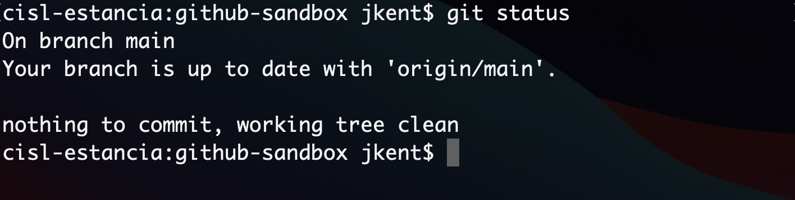
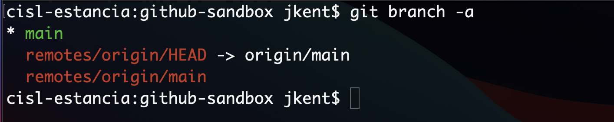
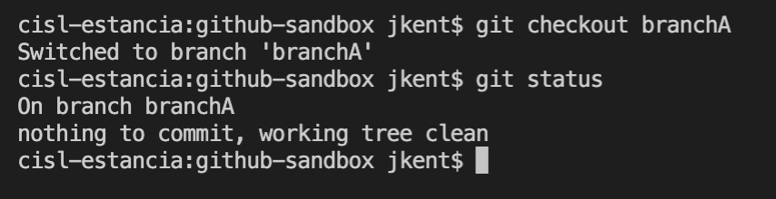
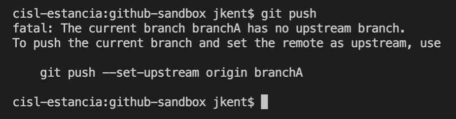
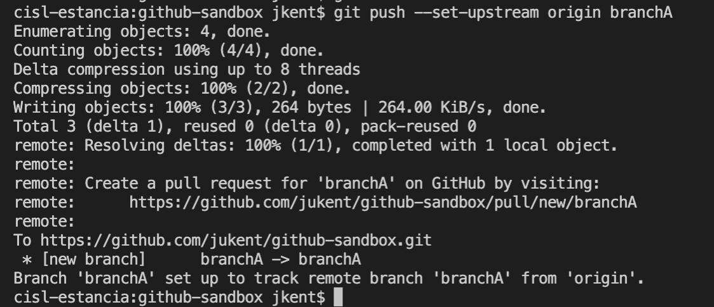
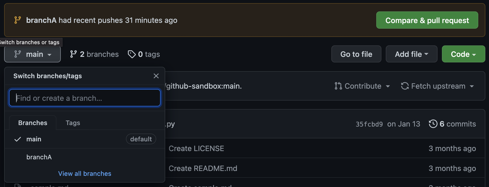
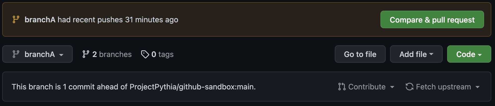
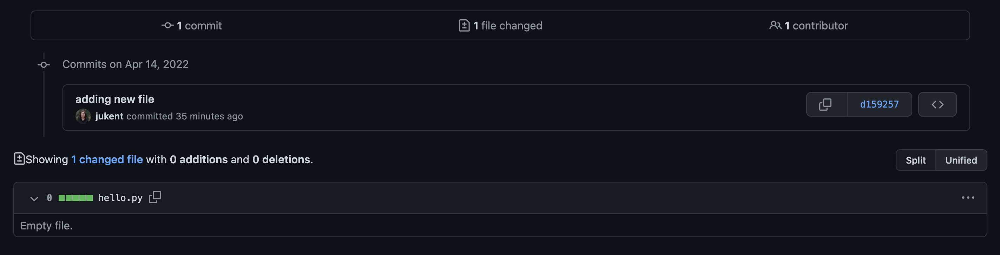
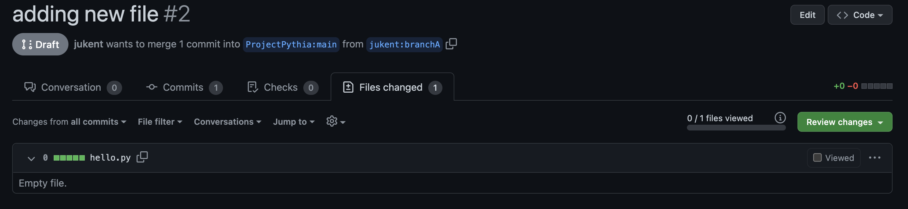

# Git Branches

The best practices for a simple workflow for sugesting changes to a GitHub repository are: create your own fork of the repository, make a branch from your fork where your changes are made, and then suggest these changes move to the upstream repository with a pull request. This section of the GitHub chapter assumes you have read all prior GitHub sections, are familiar with git commands and the vocabulary ("cloning," "forking," "merging," "pull request" etc), and that you have already created your own fork of the [GitHub Sandbox Repository](https://github.com/ProjectPythia/github-sandbox) hosted by Project Pythia. That fork is where you will make your first Git branch while following along with this chapter.

## Overview:

1. What are Git Branches
1. Creating a New Branch
1. Switching Branches
1. Setting up a Remote Branch
1. Merging Branches
1. Pulling
1. Deleting Branches

## Prerequisites

| Concepts              | Importance | Notes |
| --------------------- | ---------- | ----- |
| Prior GitHub Sections | Necessary  |       |

- **Time to learn**: 30 minutes

---

## What are Git branches?

Git branches allow for non-linear or differing revision histories of a repository. At a point in time, you can split your repository into multiple development paths (branches) where you can make different commits in each, typically with the ultimate intention of merging these branches and development changes together at a later time.

These branches can live on your computer (local) or on GitHub (remote). They are brought together through Git pushes, pulls, and pull requests. Pushing is how you transfer changes from your local repository to a remote repository. Pulling is how you fetch upstream changes into your branch. And pull requests are how you suggest the changes you've made on your branch to the upstream codebase.

One rule of thumb is for each development feature to have its own development branch until that feature is ready to be added to the upstream codebase. This allows you to compartmentalize your pull requests so that smaller working changes can be merged upstream independently of one another. For example, you might have a complete or near-complete feature on its own branch with an open pull request awaiting review. While you wait for feedback from the team before merging it, you can still work on a second feature on a second branch without affecting your first feature's pull request. **We encourage you to always do your work in a designated branch.**

<figure>

<figcaption align = "center"><b>
The above flowchart demonstraties commits (C1 through C5) added to different branches of a personal fork of the upstream main repository. Different commits can be added to either branch in any order without depending on or knowing about each other.</b></figcaption>
</figure>

## Creating a New Branch

From your terminal, navigate to your local clone of your `Github-Sandbox` Repository fork:

```
$ cd github-sandbox
```

Let's begin by checking the status of our repository:

```
$ git status
```



You will see that you are already on a branch called "main". And that this branch is up-to-date with "origin/main" and has nothing to commit.

```{admonition} The Main Branch
:class: info
The `main` branch used to automatically be called the `master` branch. This change was relatively recent, so all of your GitHub repositories may not reflect this yet. See instructions to change your branch name at [Github's Branch Renaming documentation](https://github.com/github/renaming).
```

Now check the status of your remote repository with

```
$ git remote -v
```


We are set up to pull and push from the same remote repository.

Next, check all of your exising Git branches with:

```
$ git branch -a
```



You will see one local branch (`main`) and your remote branch (`remotes/origin/HEAD` and `remotes/origin/main`, where `HEAD` points to `main`).

Now, before we make some sample changes to our codebase, let's create a new branch where we'll make these changes:

```
$ git branch newbranch
```

Check that this branch was created with:

```
$ git branch
```


This will display the current and the new branch. You'll notice that we are still on branch `main` and will need to switch branches to work in our `newbranch`.

## Switching Branches

To switch branches use the command `git checkout` as in:

```
$ git checkout newbranch
```

To check your current branch type:

```
$ git status
```



Notice that `git status` doesn't say anything about being up-to-date, as before. This is because this branch only exists locally, not in our upstream GitHub fork.

## Setting up a Remote Branch

Before we push this branch upstream, let's make some sample changes by creating a new Python file.

```
$ touch hello.py
```


You can check that this file has been created by comparing an `ls` before and after this command, and also with a `git status` that will show your new untracked file.

`git add` and `git commit` your new file and check the status again.


Your new branch is now one commit ahead of your main branch. You can see this with a `git log.`


In a real workflow, you would continue making edits and git commits on a branch as so until you are ready to push up to GitHub.

Try to do this with

```
$ git push
```



You will get an error message, "fatal: The current branch newbranch has no upstream branch." So what is the proper method for getting our local branch changes up to GitHub?

First, we need to set an upstream branch to direct our local push to:

```
$ git push --set-upstream origin newbranch
```

Thankfully, Git provided this command in the previous error message.



We can see that this worked by doing a `git branch -a`

Notice the new branch called `remotes/origin/newbranch`. And when you do a `git status` you'll see that we are up to date with this new remote branch.


On future commits you will not have to repeat these steps, as your remote branch will already be established. Simply push with `git push` to have your remote branch reflect your future local changes.

<figure>

<figcaption align = "center"><b>
The above flowchart demonstrates adding commits locally (C3 and C4) before pushing them to the corresponding remote branch.</b></figcaption>
</figure>

## Merging Branches

At this point, we will demonstrate how to merge branches via a Pull Request. Merging is how you bring your split branches of a repository back together again.

<figure>

<figcaption align = "center"><b>
The above flowchart demonstrates a simple Pull Request (PR1), the upstream main repository has accepted the changes from the Feature 2 branch of your fork. The latest commit to the Upstream Main repository is now C4. Your Feature2 branch can now be safely deleted. This flowchart has simplified out the remote and local versions of the Feature2 branch.</b></figcaption>
</figure>

The demonstration will move from your local terminal to GitHub. Go to your fork of the [GitHub Sandbox Repository](https://github.com/ProjectPythia/github-sandbox). One fast way to get to your fork, is to click the "fork" button and then follow the link underneath the message, "You've already forked github-sandbox."

When you've navigated to your fork, you should see a message box alerting you that your branch `newbranch` had recent changes with the option to generate an open pull request. This pull request would take the changes from your `newbranch` branch and suggest them for the original upstream ProjectPythia github-sandbox repository. You'll also notice that you are on branch `main`, but that there are now 2 branches.


If you click on the branch `main` you'll see the list of these branches.



There you can click on the branch `newbranch` to swtich branches.



Here you will see the message, "This branch is 1 commit ahead of ProjectPythia:main." Next to this message you'll see either the option to "Contribute" (which opens a pull request) or "Fetch Upstream" (which pulls in changes from the original repository). And just above your files you'll see your most recent commit.

Click on the "Open a Pull Request" button under the "Contribute" drop-down.


This will send you to a new page. Notice that you are now in "ProjectPythia/github-sandbox" and not your fork.


The page will have the two branches you are comparing with an arrow indicating which branch is to be merged into which. If you wanted, you could click on these branches to switch the merge configuration. Underneath that you'll see a green message, "Able to merge. These branches can be automatically merged." This message means that there are no conflicts. We will discuss conflicts in a later chapter.

In a one-commit pull request, the pull request title defaults to your commit message. You can change this if you'd like. There is also a space to add a commit message. This is your opportunity to explain your changes to the owners of the upstream repository.


And if you scroll down, you'll see a summary of this pull request with every commit and changed file listed.



Click the arrow next to "Create Pull Request" to change this to a draft pull request.


Once you've clicked "Draft Pull Request," you will be directed to the page of your new pull request. Here you can add more comments or request reviews.


Clicking "Files Changed" allows you to see all of the changes that would be merged with this pull request.



If you are working in a repository that has automatic checks, it is a good idea to wait for these checks to pass successfully before you request reviewers or change to a non-draft pull request. Do this by clicking "Ready for Review."


When working on a project with a larger team, do NOT merge your pull request before you have the approval of your teammates. Every team has their own requirements and best practice workflows, and will discuss/approve/reject pull requests together. We will cover more about the ways to interact with pull requests through conversations and reviews in a later section.

To someone with write permissions on the repository, the ability to merge will look like this green button:


However, this pull request will NOT be merged, as the GitHub-Sandbox repository is intended to be static.

<figure>

<figcaption align = "center"><b>
The above flowchart demonstrates a Pull Request (PR1) without simplifying out the remote vs local versions of the Feature2branch. Typically multiple pushes are made from your local to remote branch before a pull request is drafted to take all of those commits (C3, C4, C6, and C7) into the Upstream Main branch.</b></figcaption>
</figure>

## Pulling

Once a team member's pull request has been merged, you will find that these upstream changes are not automatically included in your fork or your branches. In order to include the changes from the upstream main branch, you will need to do a `git pull`.

<figure>

<figcaption align = "center"><b>
The above flowchart demonstrates pulling in the upstream changes from Upstream Main after the pull request PR1 has been merged. Before continuing to work, with new commits (C6), it is best to pull in the upstream changes. The local vs remote branches have been simplified out of this diagram.</b></figcaption>
</figure>

First check if there are any upstream changes:

```
$ git status
```

Then, if there are no conflicts:

```
$ git pull
```

`git pull` is a combination of `git fetch` and `git merge`. That is it updates the remote tracking branches (`git fetch`) AND updates your current branch with any new commits on the remote tracking branch (`git merge`).

<figure>

<figcaption align = "center"><b>
The above flowchart demonstrates pulling in the upstream changes from Upstream Main in a team setting. Multiple authors will have their own feature branches that merge into the same Upstream Main repository by pull requests. It is important for each author to do regular `git pulls` to stay up to date with each other's contributions. The local vs remote branches have been simplified out of this diagram.</b></figcaption>
</figure>

## Deleting Branches

After the feature you worked on has been completed and merged, you may want to delete your branch.

To do this locally, you must first switch back to `main` or any non-target branch. Then you can enter

```
git branch -d <branch>
```

for example

```
git branch -d newbranch
```

To delete the branch remotely, type

```
$ git push <remote> --delete <branch>.
```

as in

```
git push origin --delete jukent/newbranch
```

---

## Summary

- Git Branches allow you to independently work on different features of a project via differing revision histories of a repository.
- A useful workflow is to create a new branch locally, switch to it and set up a remote branch. During your revision, push to your upstream branch and pull from main as often as necessary. Then suggest your edits via a pull request and, if desired, delete your branch after the merge.

### What's Next?

Opening a Pull Request on GitHub

## References

1. “GitHub.com Help Documentation.” GitHub Docs, https://docs.github.com/en.
2. Paul, Kevin. “Python Tutorial Seminar Series - Github.” Project Pythia, YouTube, 12 May 2021, https://www.youtube.com/watch?v=fYkPn0Nttlg.
