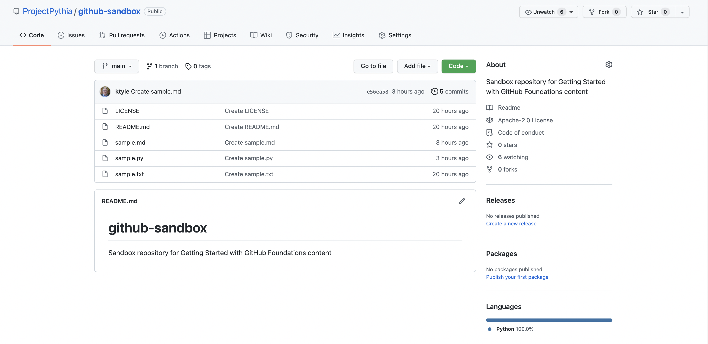
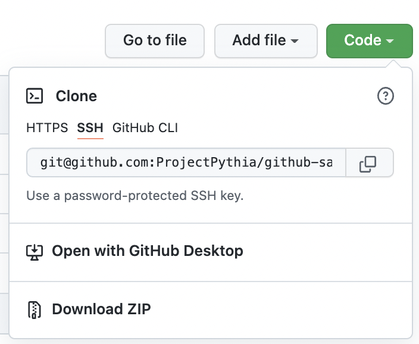
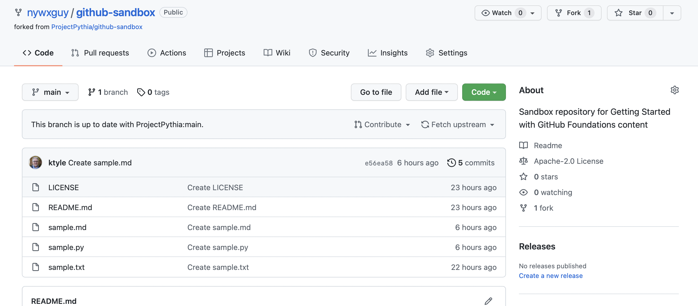
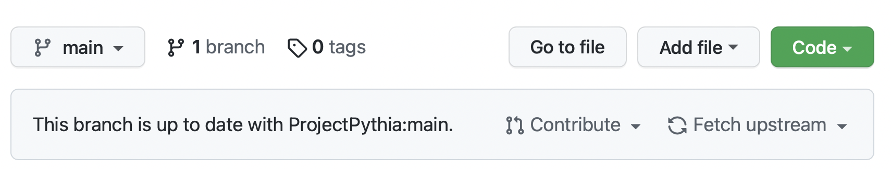

# Cloning and Forking a Repository

## Overview:

1. Cloning a repository
1. Forking a repository

## Prerequisites

| Concepts              | Importance | Notes                        |
| --------------------- | ---------- | ---------------------------- |
| Prior GitHub Sections | Necessary  | GitHub user account required |
| Command-line shell    | Helpful    |                              |

- **Time to learn**: 30 minutes

---

## Cloning a repository

Let's say you wish to copy a GitHub repository to a computer you have access to (which could be your own computer, or one you have access to at work or school).

We'll use a very basic repo that is part of the [Project Pythia organization](https://github.com/ProjectPythia) as our example.

First, point your browser to <https://github.com/ProjectPythia/github-sandbox>:



---

We see that in the repository, there exists five files. Above the list of files is this row:


---

Click on the green **Code** button to the right:



---

Select the **HTTPS** option, then click on the URL to highlight it, and finally click on the copy-to-clipboard icon:


---

Now, open up a terminal on your local computer, and if desired, `cd` into a directory that you'd like to house whatever repos you clone. Type `git clone`, and then paste in the URL that you copied from GitHub:

```
git clone https://github.com/ProjectPythia/github-sandbox.git
```

You'll see something like the following:

```
Cloning into 'github-sandbox'...
remote: Enumerating objects: 15, done.
remote: Counting objects: 100% (15/15), done.
remote: Compressing objects: 100% (14/14), done.
remote: Total 15 (delta 3), reused 0 (delta 0), pack-reused 0
Receiving objects: 100% (15/15), 7.41 KiB | 2.47 MiB/s, done.
Resolving deltas: 100% (3/3), done.
```

Now, you can `cd` into the `github-sandbox` directory which has been created and populated with the exact contents of the origin repository at the time you cloned it. If you have a Python installation, you could then type:

```
python sample.py
```

to run the sample Python script.

```{admonition} Windows users
:class: info
While `git` is typically part of a Linux or Mac OS command-line shell, similar functionality must be installed if you are running Windows. Download and install the [Git for Windows](https://gitforwindows.org/) package.
```

**Congratulations!!** You have now cloned a GitHub repository! Cloning is ideal for the following scenarios:

1. You wish to download, build, and install the latest version of a software package.
1. You would like to experiment with a repository on your local computer, but do not desire to maintain a repo on your GitHub account, nor submit your changes to the original repo.
1. You have previously _forked_ a repository to your own GitHub account, and now wish to make changes to it for possible incorporation into the original repo, via a _pull request_.

Now that we've mentioned **forking** ...

## Forking a repository

Forking is similar to cloning, but is better suited to collaborative software development. Here, you first create a copy of an existing repository, but store it in your own personal GitHub organization (recall that when you create a GitHub account, the _organization_ name is your GitHub user ID).

Let's say we intend to make some changes to the [Project Pythia Sandbox](https://github.com/ProjectPythia/github-sandbox) repo, that ultimately we'll submit to the original repository as a _Pull request_.

```{note}
Be sure you have logged into GitHub at this time!
```

Notice at the top right of the screen, there is a _Fork_ button:


---

Click on it:


---

You should see your GitHub user id (if you administer any other GitHub organizations, you will see them as well). Click on your user id to complete the _fork_. After a few seconds, your browser will be redirected to the forked repo, now residing in your personal GitHub organization:



---

Notice that the _Fork_ button on the upper right has incremented by one, and there is also is a line relating your fork to the original repo:



---

```{tip}
We discuss *branches* in the <https://foundations.projectpythia.org/foundations/github/git-branches> lesson.
```

You could, at this point, select one of the files in the repository and use GitHub's built-in editor to make changes to these text-based files. But the typical use case that leverages the collaborative power of GitHub and its command-line cousin, _git_, involves _cloning_ your _forked_ copy of the repo to your local computer, where you can then perform your edits, and (in the case of software) test them on your system.

Cloning your fork is the same as cloning the original repo. Click on the Code button, select the HTTPS protocol, copy the URL to the clipboard, and then run `git clone <URL>` on your local computer.

The process of making changes and submitting them as _pull requests_ to the original repository is covered in our <https://foundations.projectpythia.org/foundations/github/github-pull-request> lesson, but the workflow is as follows:

1. Edit an existing file or files, and/or create new files.
1. Stage your changes by running `git add`.
1. Commit your changes by running `git commit`.
1. Push your changes to your _fork_ by running `git push`.
1. In GitHub, create a _Pull request_.

```{tip}
We discuss the `git` command-line interface in the <https://foundations.projectpythia.org/foundations/github/what-is-git> lesson.
```

---

## Summary

- The process of making a copy of a GitHub repository is called _cloning_.
- _Forking_ a repository also makes a copy of a GitHub repo, but places it in your GitHub organization.
- Forking allows you to modify a repo, without affecting the original version.
- After cloning your fork to your local computer, you can meke changes to your copy, which you can then submit to the original repo as a _Pull request_.

## Things to try

- Clone another GitHub-hosted repository that is of interest to you.
- Then try creating a fork of that repository.

### What's Next?

In the next lesson, you will configure your GitHub account with security keys that will enable the use of the SSH (secure shell) protocol.

## References

1. [Cloning vs Forking (GitHub Support)](https://github.community/t/the-difference-between-forking-and-cloning-a-repository/10189)
1. [What the Fork?(GitHub Community)](https://github.community/t/what-the-fork/10187)
