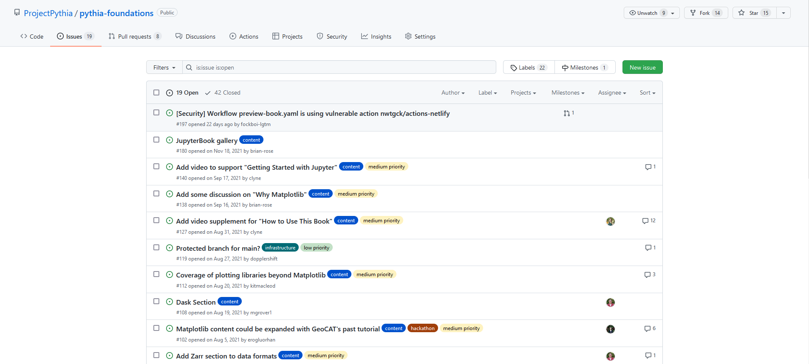
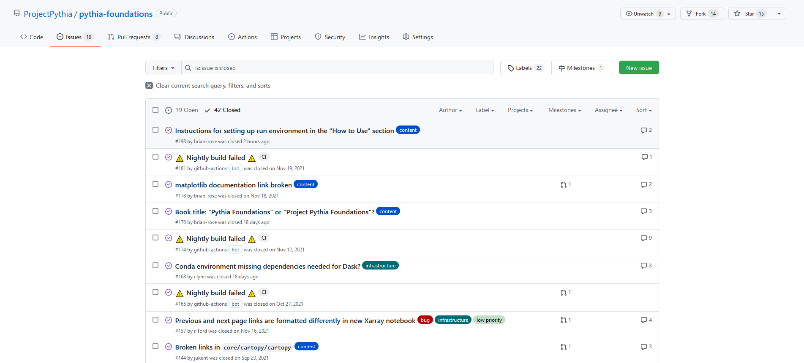
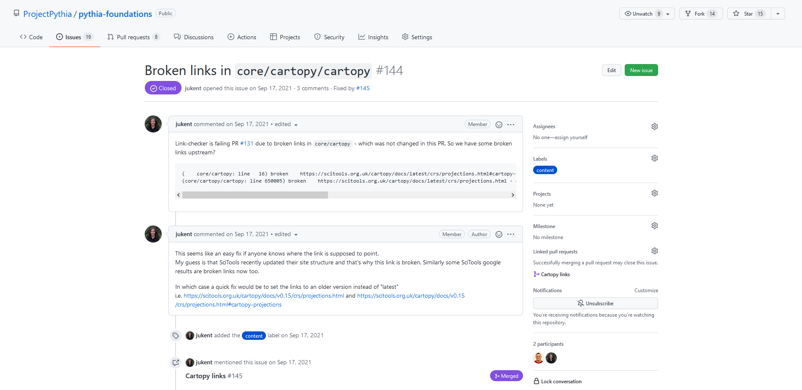

# Issues and Discussions

## Overview:

1. Examine an existing issue and discussion

## Prerequisites

| Concepts              | Importance | Notes |
| --------------------- | ---------- | ----- |
| Prior GitHub Sections | Necessary  |       |

- **Time to learn**: 15 minutes

---

As mentioned in the previous section, GitHub Issues and Discussions allow collaboration within a repository. First, let's take a look at the [Issues page](https://github.com/ProjectPythia/pythia-foundations/issues) in Project Pythia's `pythia-foundations` repository:

By default, it shows all open issues, but we can see all [closed issues](https://github.com/ProjectPythia/pythia-foundations/issues?q=is%3Aissue+is%3Aclosed) by clicking "Closed".

Issues, Discussions, and Pull Requests are all numbered for easy reference. Let's examine [Issue \#144](https://github.com/ProjectPythia/pythia-foundations/issues/144).

As you can see, some broken links were found in one of the Pythia Foundations tutorials, likely because the site being linked recently had its structure changed. An additional comment was added, as well as a label to help filtering/sorting issues by topic. We then see that this issue was mentioned (by typing the issue number) elsewhere in the repository. In this case, it was mentioned in [Pull Request \#145](https://github.com/ProjectPythia/pythia-foundations/pull/145), which makes the changes to fix the issue. We can also see that the PR has been merged, which means the changes have been incorporated into the main branch of the code.

Like this example, issues can notify others of bugs or typos, but they can also be used as "calls to action", whether you plan on addressing the issue yourself or are hoping that someone else will be interested in making the changes. Issues [\#97](https://github.com/ProjectPythia/pythia-foundations/issues/97) and [\#98](https://github.com/ProjectPythia/pythia-foundations/issues/98) are examples of this, in which ideas for changes are proposed and then addressed at a later time.

Discussions, on the other hand, are more open-ended and do not _necessarily_ suggest a change or addition to the repository. Here is Project Pythia's Discussions page:

Let's take a look at [Discussion \#156](https://github.com/ProjectPythia/pythia-foundations/discussions/156).

This discussion brings up a resource relevant to the repository that could help others, but it is not suggesting a change like an issue would. Other discussions might include announcements, Q&A, or general thoughts about the repository.

---

## Summary

- GitHub provides Issues and Discussions to facilitate collaboration.
- Issues are specific and actionable, while discussions are open-ended.

### What's Next?

We will work through cloning and forking an example repository.
