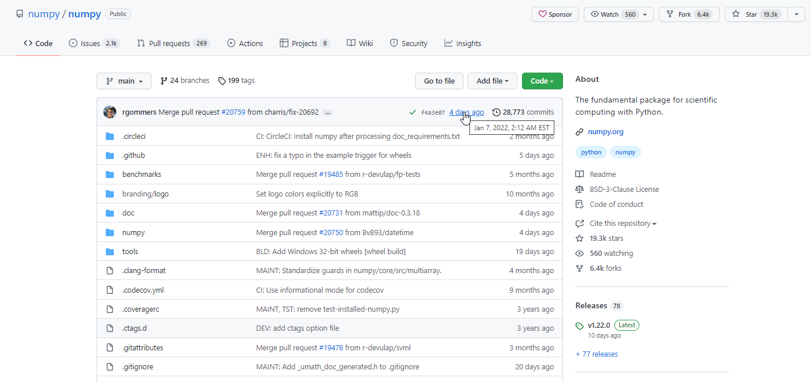
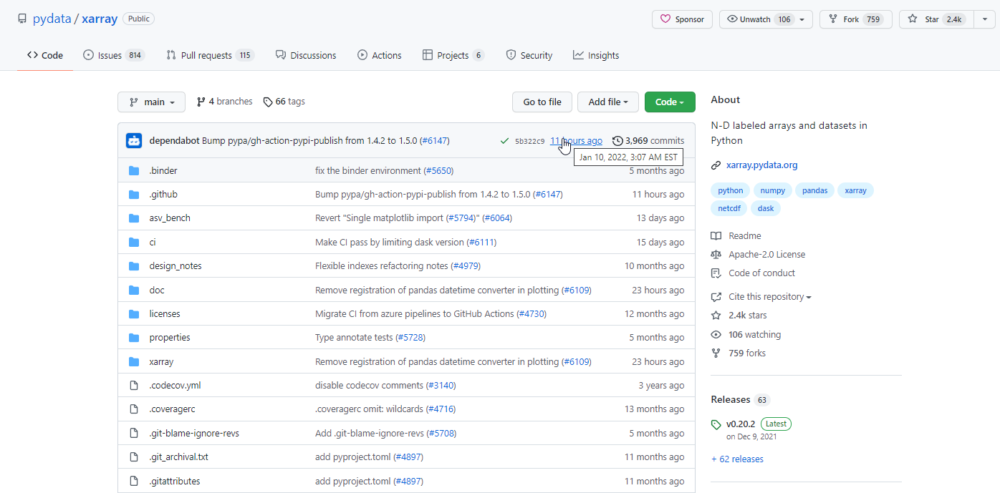
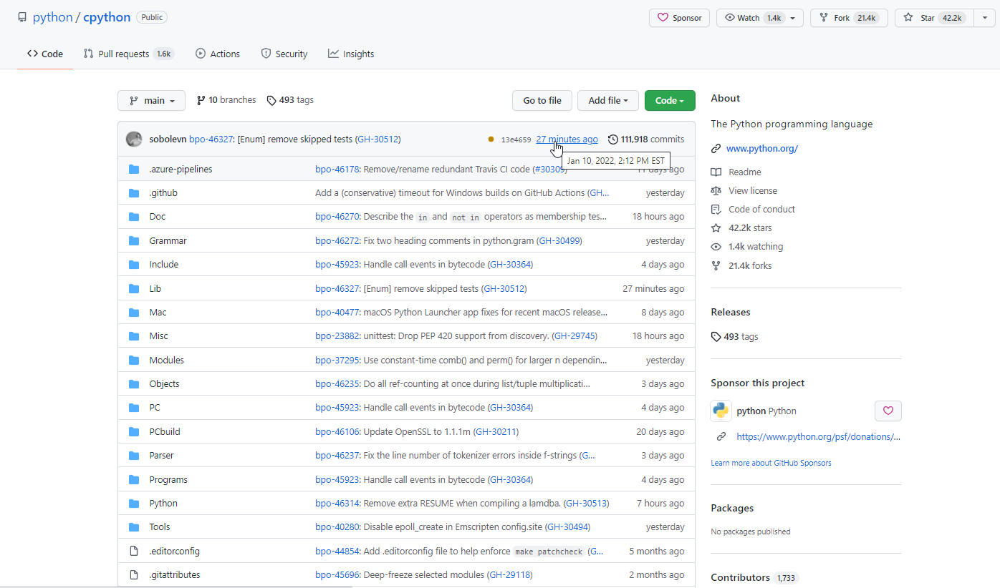
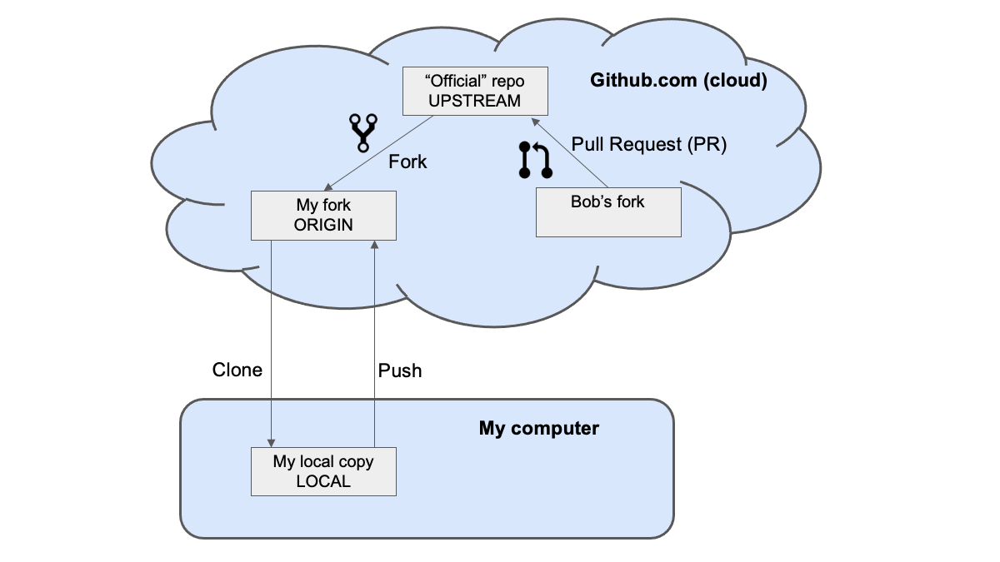

```{image} ../../images/GitHub-logo.png
:alt: GitHub Logo
:width: 400px
```

# GitHub Repositories

## Overview:

1. Explore GitHub Repositories

## Prerequisites

| Concepts                                                                                        | Importance | Notes |
| ----------------------------------------------------------------------------------------------- | ---------- | ----- |
| [What is GitHub?](https://foundations.projectpythia.org/foundations/github/what-is-github.html) | Necessary  |       |

- **Time to learn**: 15 minutes

---

## What is a GitHub repository?

GitHub gives the following explanation of a [repository](https://docs.github.com/en/get-started/quickstart/hello-world):

> A repository is usually used to organize a single project. Repositories can contain folders and files, images, videos, spreadsheets, and data sets -- anything your project needs. Often, repositories include a `README` file, a file with information about your project. GitHub makes it easy to add one at the same time you create your new repository. It also offers other common options such as a license file.

In short, it is a _collection of files_. Each GitHub repository has an _owner_, which could be an individual or an organization. Repositories can also be set to _public_ or _private_, determining who can see and interact with it. While a repository can simply store files, GitHub is designed with **collaboration** in mind. Three key collaborative tools in GitHub are:

1. **Issues**: report a bug, plan improvements, or provide feedback to others working on the repository.
1. **Discussions**: post ideas or other conversations that are not as specific or actionable as an **Issue**.
1. **Pull requests**: We will go into the specifics later, but a **Pull request** allows a user to _propose a change_ to any of the files within a repository.

```{admonition} Tip
:class: tip
Typically, a GitHub repository will always include the **Issues** and **Pull requests** tabs. **Discussions** are not enabled by default, but are increasingly prevalent.
```

## What are some examples of repositories?

All of the Python packages covered (e.g. [Numpy](https://github.com/numpy/numpy) and [Xarray](https://github.com/pydata/xarray)) in this Foundations book have associated GitHub repositories, as well as [Python itself](https://github.com/python/cpython):







As you can see by the recent timestamps, these repositories are actively changing; this reflects the adaptability of the [open-source software](https://opensource.org/osd) ecosystem surrounding Python.

```{admonition} Tip
:class: tip
Notice that each of the three *Repositories* each exist as part of their own *Organization*. In other words, the NumPy repository exists within the NumPy organization; the Xarray repo exists within the Pydata org, and so forth.

When you [create your own GitHub account](https://foundations.projectpythia.org/foundations/github/what-is-github.html), your user ID functions as the *organization*. Any repositories you create (and therefore, *own*) will exist within that org.
```

Another example is this project's [Pythia Foundations repository](https://github.com/ProjectPythia/pythia-foundations), on which this tutorial is stored. It is owned by the [Project Pythia organization](https://github.com/ProjectPythia). This organization also owns several other repositories that store the files needed to generate <https://projectpythia.org/>, among other things.

## GitHub's distributed repositories

Finally, we introduce an important concept that is vital to your
understanding when working with GitHub. It is the source of GitHub's power, as well
as much of its complexity. GitHub repositories
are _distributed_; in the general case, there is more than one
repository for any project. In fact, repositories can come and go
at any time, created and deleted as need dictates. Creating new
repositories from existing ones, synchronizing them, and managing them
are the topics of later sections. For now, it is only important to
understand that or a GitHub-managed project, there is typically one
"official" repository, often called the "upstream" repository, and it lives on GitHub.com. There may be any
number of copies of the "official" repository, known as _forks_ (or _origins_,
if it is owned by you),
that also reside on GitHub.com. Repos that are hosted on GitHub.com
are referred to as _remotes_. In addition to the remotes, there may
be one or more copies of the remotes on your desktop or laptop
computer that are referred to as _locals_. A conceptual diagram of
the various repos is shown in the image below.



---

## Things to try:

1. Browse the [NumPy](https://github.com/numpy/numpy), [Xarray](https://github.com/pydata/xarray), [Python](https://github.com/python/cpython), and [Pythia Foundations](https://github.com/ProjectPythia/pythia-foundations) repos.
1. Browse the organizations (e.g., [Pydata](https://github.com/pydata)) which house the repos within.
1. Check out GitHub's ["Create a repo"](https://docs.github.com/en/get-started/quickstart/create-a-repo) tutorial to learn how to create your own repository!

---

## Summary

- GitHub's Repositories are collections of files.
- Issues, Discussions, and Pull requests can be used to collaborate within a repository.
- A GitHub _Organization_ contains _Repositories_.

### What's Next?

We will further explore Issues and Discussions.

## References

1. [GitHub's quickstart guide](https://docs.github.com/en/get-started/quickstart)
