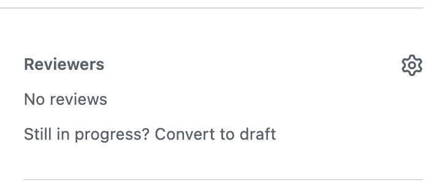
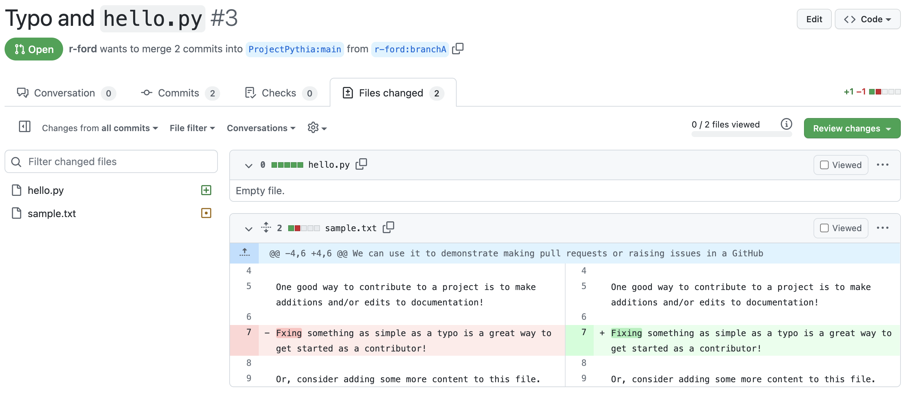
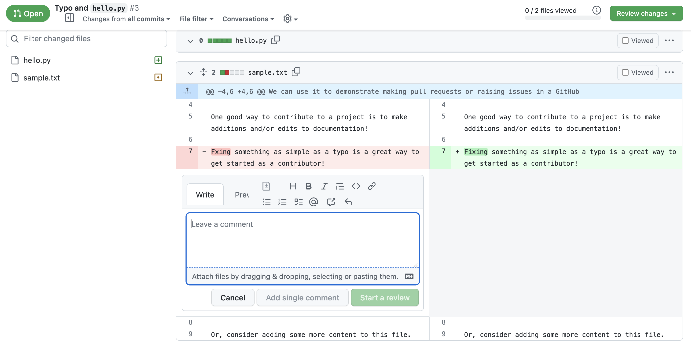
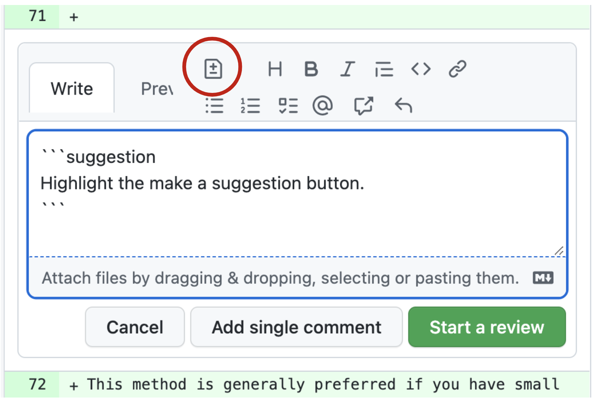
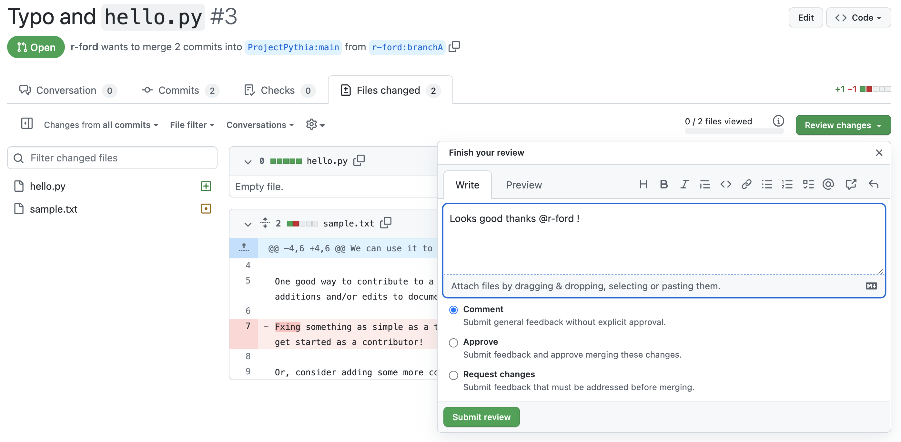

```{image} ../../images/GitHub-logo.png
:alt: GitHub Logo
:width: 400px
```

# Reviewing Pull Requests

Pull Requests (PRs) are typically reviewed by collaborators before being merged in to the main project branch. If you've been asked to review a PR, perhaps you're feeling overwhelmed, underqualified, or just plain don't know where to start. Remember that your teammates want to make the best project they can, and they want your feedback to help get there, so dive in! Here are some tips on how to effectively review a PR that can help.

## Overview:

1. What is a Pull Request Review?
1. Requesting Pull Request Reviews
1. Ways to View a Pull Request
1. Providing a Pull Request Review
1. What to Look for When Reviewing

## Prerequisites

| Concepts                                      | Importance  | Notes |
| --------------------------------------------- | ----------- | ----- |
| [What is GitHub](what-is-github)              | Necessary   |       |
| [GitHub Repositories](github-repos)           | Necessary   |       |
| [Cloning and Forking](github-cloning-forking) | Necessary   |       |
| [Basic Version Control with _git_](basic-git) | Necessary   |       |
| [Issues and Discussions](github-issues)       | Recommended |       |
| [Branches](git-branches)                      | Necessary   |       |
| [Pull Requests](github-pull-request)          | Necessary   |       |

- **Time to learn**: 30 minutes

---

## What is a Pull Request Review?

A PR Review is an opportunity for a team member to look through proposed file changes and request changes before merging into the main project branch. You may ask clarifying questions, ask for things to be changed, or suggest concrete edits. The author should satisfy your requests before the PR is merged (and may have to, if your branch protections are configured).

## Requesting Pull Request Reviews

When you think your PR might be ready to be merged into the main project branch, it is time to request reviews.

You can do this by navigating to the right side bar menu of your PR's page. Under "Reviewers", select the gear icon, and then select or enter a GitHub user's ID for whom you would like to approve your work. GitHub may suggest certain reviewers based on file codeowners or recent editors of the same files.

<br/>

```{admonition} Did you know?
:class: info
It is possible to automate this process with a `CODEOWNERS` file and [GitHub actions](https://docs.github.com/en/actions).
```

Learn more at GitHub's [Requesting a Pull Request Review Documentation](https://docs.github.com/en/pull-requests/collaborating-with-pull-requests/proposing-changes-to-your-work-with-pull-requests/requesting-a-pull-request-review).

## Ways to View a Pull Request

So you've been requested for review on a PR. What do you do now? First make sure you can view the files changed in a meaningful way.

A PR has a "Files Changed" tab, so look here first. You will notice green and red highlighting to show added and removed content.

<br/>

But this raw content can be hard to interpret if the files you are reviewing are meant to be rendered as a webpage or a Jupyter Notebook, for example.

Often, repositories that have lots of Jupyter Notebooks or webpage content will use GitHub actions to provide content previews of the deployed site or use a service such as [ReviewNB](https://www.reviewnb.com/). Be careful when navigating a previewed site deployment because any absolute links will take you out of the preview.

One trusty way to view the rendered content is to locally check out the PR branch. By bringing the content to your typical workspace, you should be able to use your prefered code editor as well as any necessary terminal commands to view and render the content. Read more at GitHub's [checking out pull requests locally documentation](https://docs.github.com/en/pull-requests/collaborating-with-pull-requests/reviewing-changes-in-pull-requests/checking-out-pull-requests-locally).

Whether looking at the content locally, in a deployment preview, or with ReviewNB, you should still use the "Files Changed" list to guide where you concentrate your review, as these other services may not direct you to where changes occured.

## Providing a Pull Request Review

Back in the "Files Changed" tab you can add in-line review comments by selecting the "+" icon to the left of the desired line. That will open a comment box with the options to "Add a single comment" or "Start Review".

<br/>

This method is generally preferred if you have comments that are relevant to specific lines of the code.

This is also the prefered method if you've noticed small edits that are easy for you, the reviewer, to implement yourself. This can be done by suggesting changes with the "+-" icon (circled in red below). This will auto-format and auto-populate with the line you are editing, which you then edit. <br/>

 <br/>

For larger change requests, questions, or approvals, you can also comment, approve, express gratitude, or request changes from the top right menu.

<br/>

"Comment" is for leaving comments on the PR. This is a chance to provide feedback or ask questions that shouldn't hinder the process of merging the PR.

"Approve" is for when you think the new content changes are great and should be pulled into the main code branch as soon as possible. Let's get this merged (LGTM)!

"Request changes" is for when you've noticed something that should be improved upon before the codebase is merged.

And then finish your review!

## What to Look for When Reviewing

Here are some more tips on what to look for during your review:

- Look at the description and linked GitHub issue to make sure the PR addresses the issue
- See if you can parse what the PR does and why
- Look at the content for spelling errors
- Provide feedback on the code itself (Are there tests? Are they robust enough? Can you follow it? Do you know a cleaner method? Are variable names conflicting? etc)
- If the PR is meant to be rendered, preview how the rendered content looks to check for image resolution and functionality
- And voice the limitations of your review! It is okay to not address all of these points in your review, but let your team know what you did look for (content vs code, e.g.). **Your opinion matters.**

---

## Summary

- A PR Review is a way of safeguarding the main project branch by having other contributors look through code before it is merged.
- There are several things to keep in mind when reviewing code; try to articulate what you based your review on.

### What's Next?

In the next lesson we will learn more about [GitHub Workflows](github-workflows).

## References

1. GitHub's [Collaborating with Pull Requests](https://docs.github.com/en/pull-requests/collaborating-with-pull-requests)
2. GitHub's [Requesting a Pull Request Review](https://docs.github.com/en/pull-requests/collaborating-with-pull-requests/proposing-changes-to-your-work-with-pull-requests/requesting-a-pull-request-review)
3. GitHub's [Checking Out Pull Requests Locally](https://docs.github.com/en/pull-requests/collaborating-with-pull-requests/reviewing-changes-in-pull-requests/checking-out-pull-requests-locally)
