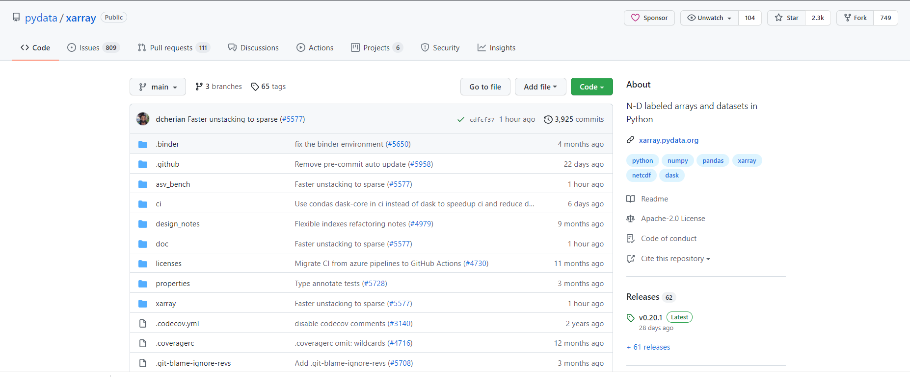

# GitHub Part 1: What is GitHub?

## Overview:

1.  Free- and open-source software (FOSS)
1.  GitHub: A (social) platform for sharing FOSS

## Prerequisites

| Concepts | Importance | Notes |
| -------- | ---------- | ----- |
| None     |            |       |

- **Time to learn**: 15 minutes

---

## Free- and open-source software (FOSS)

Much of what we term the _scientific Python software ecosystem_ consists of _free- and open-source software_. Often abbreivated as **FOSS**, this means:

1.  The software is free-of-charge, and
1.  The various files which contain the _software code_ are publicly available.

   
 <b>Did you know? </b>The <a href="https://python.org">Python language</a> itself is an example of <i>FOSS</i>!
   

FOSS is nothing new. For example, the [Linux kernel source code](https://kernel.org) has been available to download for many years.

   
<b>Free $\neq$ open source!</b> Just because a software package may be free does not mean that its source code is open! For example, although Nvidia makes its video drivers available for free download, the source code for those drivers is proprietary.
   

Arguably, the greatest advantage of open-source software is that it enables _collaborative sharing_, and thus community feedback.

Types of community input may include the following:

1. _Issues_: usage questions, bug reports, feature requests
1. _Pull requests_: a user can ask that that their changes/additions be incorporated into the project
1. _Discussions_: a community forum on the open source project

## Version control systems (VCS)

We will discuss version control in more detail later in this series, but the need to track and manage changes to a project, especially one that involves software, has long been known. Over the years, FOSS developers have used VCS such as _cvs_, _svn_, and most recently, _git_. All of these systems are _command-line tools_.

## FOSS and VCS on the Internet

A successful FOSS project needs to be accessible via the web. As mentioned before, the Linux kernel and the Python language have long been available using first-generation remote access protocols such as FTP and HTTP, and SSH. Later, VCS tools such as cvs and svn established their own TCP protocols for remote access. With the advent of _git_, web-based services that supported HTTP(S) and SSH sprung up. Each of these VCS leverages the concept of a particular FOSS project as a <i>code repository</i>.

   
 <b>Did you know? </b>Linus Torvalds, the original developer (and still the lead maintainer) of <b>Linux</b>, is also the original developer of <a href="https://git-scm.com/">git</a>! 

   
 <b>Stay tuned! </b>We will discuss version control and the use of <b>Git</b> via the command line later in this series. 

## GitHub: a social platform for sharing FOSS via Git

Perhaps the most popular web-based platform that uses Git for FOSS VCS is [GitHub](https://github.com). GitHub hosts all of the Python software packages that Project Pythia covers are hosted as code repositories (we'll use the term <i>Git repo</i>, or more generally just <i>repo</i> henceforth to represent a GitHub code repository).

For example, here is a screenshot from [Xarray's GitHub](https://github.com/pydata/xarray) Git repo:

There are several clickable items just below the **pydata/xarray** header, including links to _Issues_, _Pull requests_, and _Discussions_ mentioned above.

   
 <b>Browse the repo </b>Take a tour of this repo by clicking anywhere you see a link! For example, below is a snippet from a recently-posted <a href="https://github.com/pydata/xarray/issues/6036">Issue</a>:

   
Next, check out the <i>Pull requests</i> and <i>Discussions </i>sections. Then, explore other GitHub repositories, such as <a href="https://github.com/scikit-learn/scikit-learn">scikit-learn</a> and <a href="https://github.com/Unidata/MetPy">MetPy</a>. 

   
 <b>Note:</b> While we will mostly be focusing on GitHub <i>repositories</i>, each repo sits within a parent <i>project</i> folder. For example, <a https://github.com/projectpythia>Project Pythia's</a> top-level GitHub project contains several repositories within, as shown below.
   

---

## Summary

- GitHub serves as a web-based platform for a collection of free- and open-source software repositories.
- GitHub uses Git as its version control system.

### What's Next?

In the next lesson, you will set up a free account on GitHub.

## References

1. Ref 1
1. Ref 2
