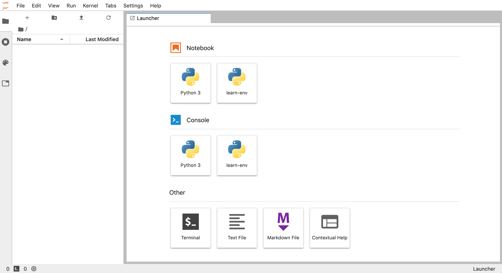
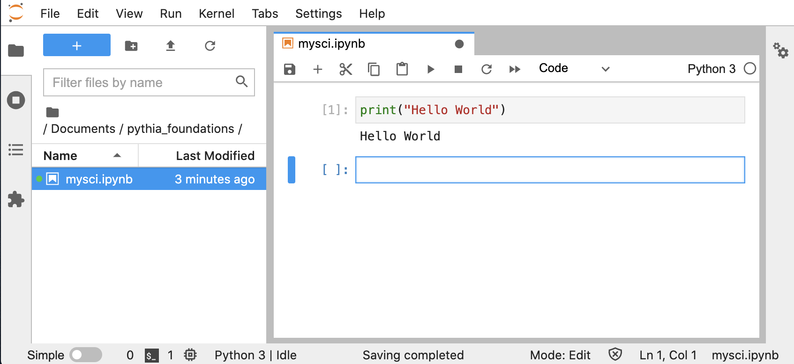

# Python in Jupyter

You'd like to learn to run Python in a Jupyter session. Here we will cover:

- Installing Python in Jupyter
- Running Python code in Jupyter

## Installing Python in Jupyter

To run a Jupyter session you will need to install some necessary packages into your Conda environment.
You can install `miniconda`. You can do that by following the [instructions for you machine](https://docs.conda.io/en/latest/miniconda.html).

Then create a Conda environment with Python installed. In the terminal type:

```
$ conda create --name pythia_foundations python jupyterlab nb_conda_kernels
```

Test that you have installed everything correctly by first activating your environment and then launching a Jupyter Lab session:

```
$ conda activate pythia_foundations
$ jupyter lab
```

Or you can install the full [Anaconda](https://www.anaconda.com/products/individual), and select **LAUNCH** under the Jupyter panel in the GUI.


In both methods, a new window should open automatically in your default browser. You can change the browser when launching from the terminal with (for example):

```
jupyter lab —browser=chrome
```

## Running Python in Jupyter

1. With your Conda environment activated and Jupyter session launched (see above),create a directory to store our work. Let's call it `pythia-foundations`.

   

   You can do this in the GUI left side bar by clicking the new-folder icon. If you prefer to use the command line you can access a terminal by clicking the icon under the "Other" heading in the Launcher.

2. Create a new `mysci.ipynb` file within the pythia-foundations folder:

   Do this in the GUI on the left side bar by clicking the "+" icon.

   This will open a new launcher window where you can select the desired Python kernel under the "Notebooks" heading for your project. Typically you can select "Python 3" or the name of a specific kernel.

   Selecting a kernel will open a Jupyter notebook instance and add an untitled file to the left side bar navigator, which you can then rename to `mysci.ipynb`.

3. Change the first notebook cell to include the classic first command - printing, "Hello, world!".

   ```python
   print("Hello, world!")
   ```

4. Run your cell with **SHIFT ENTER** and see that the results are printed below the cell.

   

**Congratulations!** You have just set up your first Python environment and run your first Python code in a Jupyter notebook.
