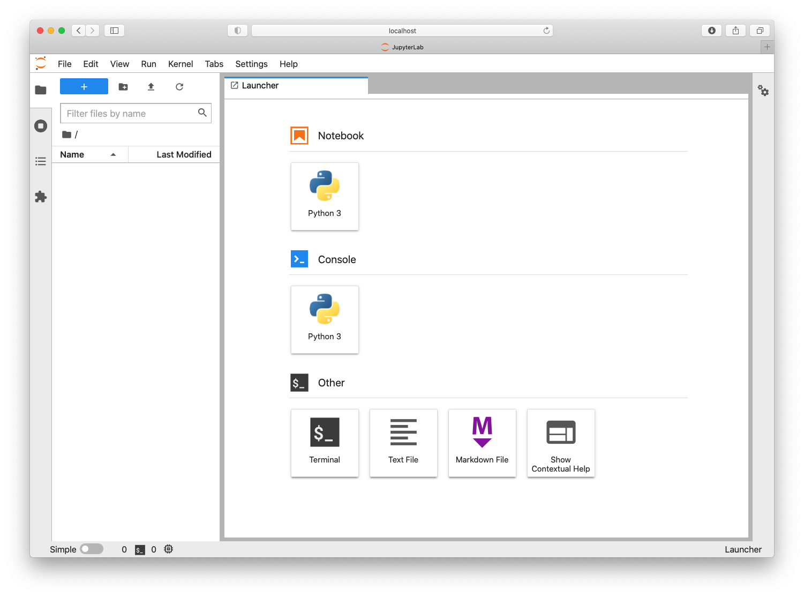

# Python in Jupyter

---

## Overview

You'd like to learn to run Python in a Jupyter session. Here we will cover:

1.  Installing Python in Jupyter
2.  Running Python code in Jupyter
3.  Saving your notebook and exiting

## Prerequisites

| Concepts                                                                                                  | Importance | Notes |
| --------------------------------------------------------------------------------------------------------- | ---------- | ----- |
| [Installing and Running Python](https://foundations.projectpythia.org/foundations/how-to-run-python.html) | Helpful    |       |

- **Time to learn**: 20 minutes

---

## Installing Python in Jupyter

To run a Jupyter session, you will need to install some necessary packages into your Conda environment.

Install `miniconda` by following the [instructions for your machine](https://docs.conda.io/en/latest/miniconda.html).

[Learn more about Conda here](conda.md)

Next, create a Conda environment with Jupyter Lab installed. In the terminal, type:

```
$ conda create --name pythia_foundations_env jupyterlab
```

Test that you have installed everything correctly by first activating your environment and then launching a Jupyter Lab session:

```
$ conda activate pythia_foundations_env
$ jupyter lab
```

Or you can install the full [Anaconda](https://www.anaconda.com/products/distribution), and select **LAUNCH** under the Jupyter panel in the GUI.


In both methods, a new window should open automatically in your default browser. You can change the browser when launching from the terminal with (for example):

```
jupyter lab —browser=chrome
```

## Running Python in Jupyter

1. With your Conda environment activated and Jupyter session launched (see above), create a directory to store our work. Let's call it `pythia-foundations`.

   

   You can do this in the GUI left sidebar by clicking the new-folder icon. If you prefer to use the command line, you can access a terminal by clicking the icon under the "Other" heading in the Launcher.

2. Create a new `mysci.ipynb` file within the `pythia-foundations` folder:

   Do this in the GUI on the left sidebar by clicking the "+" icon.

   This will open a new launcher window where you can select a Python kernel under the "Notebooks" heading for your project. _You should see "Python 3" as in the screenshot above._ Depending on the details of your system, you might see some additional buttons with different kernels.

   Selecting a kernel will open a Jupyter notebook instance and add an untitled file to the left sidebar navigator, which you can then rename to `mysci.ipynb`.

   Select "Python 3" to use the Python version you just installed in the `pythia_foundations_env` conda environment.

3. Change the first notebook cell to include the classic first command: printing, "Hello, world!".

   ```python
   print("Hello, world!")
   ```

4. Run your cell with {kbd}`Shift`\+{kbd}`Enter` and see that the results are printed below the cell.

   

**Congratulations!** You have just set up your first Python environment and run your first Python code in a Jupyter notebook.

## Saving your notebook and exiting

When you are done with your work, it is time to save and exit.

To save your file, you can click the disc icon in the upper left Jupyter toolbar or use keyboard shortcuts.

Jupyter allows you to close the browser tab without shutting down the server. When you're done working on your notebook, _it's important to **click the "Shutdown" button** on the dashboard_ to free up memory, especially on a shared system.

Then you can quit Jupyter by:

- clicking the "Quit" button on the top right, or
- typing `exit` into the terminal

Alternatively you can simultaneously shutdown and exit the Jupyter session by typing
{kbd}`Ctrl`\+{kbd}`C` in the terminal and confirming that you do want to
"shutdown this notebook server."

---

## Summary

Jupyter notebooks are a free, open-source, interactive tool running inside a web browser that allows you to run Python code in "cells." To run a Jupyter session you will need to install `jupyterlab` into your Conda environment. Jupyter sessions need to be shutdown, not just exited.

### What's Next?

- [How to Run Python in the Terminal](terminal.md)
- [Learn more about Conda here](conda.md)
- [Getting Started with Jupyter](getting-started-jupyter)

## Resources and References

- [Anaconda](https://www.anaconda.com/products/distribution)
