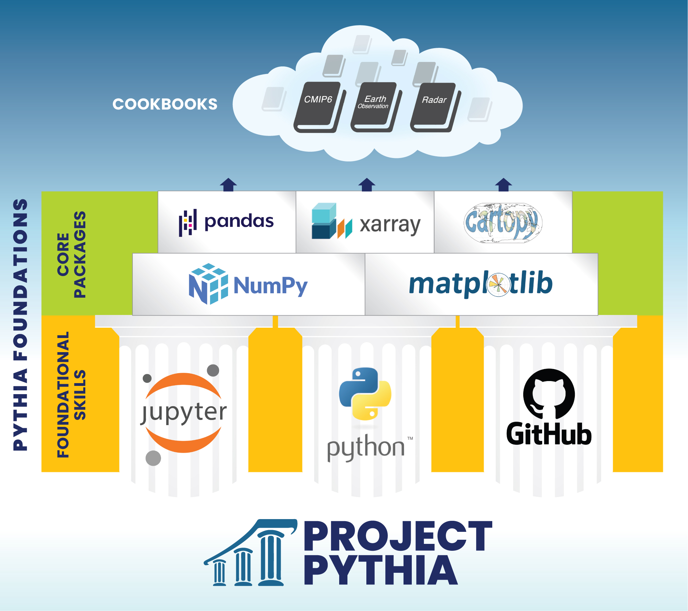

# Overview

This **Foundational Skills** section of the book contains cross-referenced tutorial material for computing skills that one needs in order to work effectively with the open-source Scientific Python stack.

Familiarizing yourself with these topics first will allow you to get the most out the Python-specific material in the [Core Scientific Python Packages](../core/overview) section of the book!

## Roadmap

This section starts with a discussion about [why we use the Python language](why-python). From there, our [Zero to Python quickstart guide](quickstart) gives an interactive tour of Python for those migrating from other programming languages, followed by a detailed [installation guide](how-to-run-python) showcasing some different ways to install the necessary software and run Python code on various platforms.

We then turn our attention to the [Jupyter ecosystem](getting-started-jupyter), a set of tools for interactive and reproducible computing that is very widely used in the geosciences. This includes a tutorial on running and editing notebooks in [JupyterLab](jupyterlab) which is our recommended way to interact with most of the content in Pythia Foundations and the [Pythia Cookbooks](https://cookbooks.projectpythia.org).

Finally we offer a comprehensive set of [tutorials on git and GitHub](getting-started-github), including how to get started with a [free GitHub account](github/what-is-github) (and why you would want to), make use of GitHub's collaboration features like [Issues and Discussions](github/github-issues), an introduction to
[version control with git](github/basic-git), and more!

The ultimate goal of [GitHub section of the book](getting-started-github) is to empower you the reader to make your own contributions to open source projects through [Pull Requests on GitHub](github/github-pull-request), including specific guidance on [making contributions to Project Pythia](github/contribute-to-pythia).

[Fork](github/github-cloning-forking) away!

## Topics

- [Why Python?](why-python): A brief preamble about Python's distinguishing features.
- [Getting started with Python](getting-started-python): A quickstart Python example, followed by detailed tutorials on how to install and run Python on your own system.
- [Getting started with Jupyter](getting-started-jupyter): All about the Jupyter ecosystem, which provides tools and environments for interactive, reproducible computing with Python.
- [Getting started with GitHub](getting-started-github): Learn about the collaboration tools (GitHub) and version control software (Git) that enable the open-source community.
